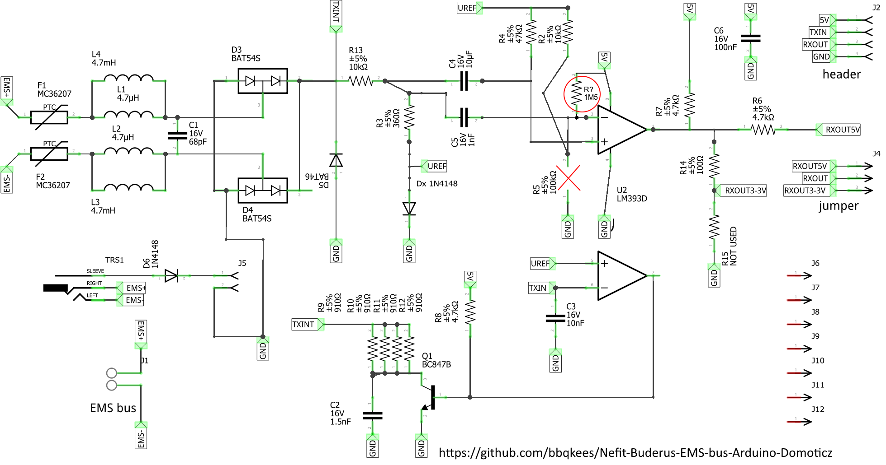

# IRT-EMS-ESP

This code is a first attempt at supporting the Nefit / Buderus iRT protocol. It is a fork of [Proddy EMS-ESP](https://github.com/proddy/EMS-ESP) project. This project is kept compatible, to make it easy to integrate upstream changes.

## Suported features

Currently the software can decode the water temperature, if de boiler is running, heating or warm water and if the pump is running.

Please keep in mind this software is highly experimental. It works on my boiler, it may not on yours. But if it does not work, create a log file (`log j`), create a ticket, and I will see what I can do.

## Building the software and first start

For building the software, have a look at [Proddy's wiki](https://github.com/proddy/EMS-ESP/wiki/Building-and-Uploading-the-Firmware).

Because the software is kept compatible, the TX-Mode needs to be set on the first run. Telnet to the device and issue the following commands:

`set tx_mode 4`

`restart`

The device will now restart, if the device is back. Reconnect and enable logging (`log j`). The output should look like this:
```
log j

System Logging set to Jabber mode
(00:56:43.985) irt_parseTelegram: 00 05 35: 01 01 FE 90 90 E6 E6 D0 D0 2E 2E CF 30 82 82 6B 6B B8 B8 86 86 00 FF A3 A3 07 07 D3 D3 CA CA 03 FC A4 A4 7D 7D AC AC DC DC 2A D5 8A 8A A1 A1 98 98 83 83 FE 01 
(00:56:48.985) irt_parseTelegram: 00 05 35: 01 01 FE 90 90 40 40 5A 5A 61 61 CF 30 93 93 73 73 0E 0E 4D 4D FF 00 C9 C9 C3 C3 79 79 AB AB 00 FF F0 F0 01 01 CD CD ED ED 00 FF F0 F0 01 01 D8 D8 B9 B9 05 FA 
(00:56:54.025) irt_parseTelegram: 00 05 35: 01 01 FE 90 90 C3 C3 79 79 F2 F2 CF 30 82 82 C3 C3 79 79 E0 E0 00 FF A3 A3 C3 C3 79 79 C1 C1 03 FC A4 A4 C3 C3 79 79 C6 C6 2A D5 8A 8A C3 C3 79 79 E8 E8 FE 01 
(00:56:59.065) irt_parseTelegram: 00 05 35: 01 01 FE 90 90 C3 C3 79 79 F2 F2 CF 30 81 81 C3 C3 79 79 E3 E3 51 AE 86 86 C3 C3 79 79 E4 E4 E9 16 85 85 C3 C3 79 79 E7 E7 74 8B 83 83 C3 C3 79 79 E1 E1 A0 5F 
(00:57:03.625) irt_parseTelegram: 00 05 35: 01 01 FE 90 90 C3 C3 79 79 F2 F2 CF 30 82 82 C3 C3 79 79 E0 E0 00 FF A3 A3 C3 C3 79 79 C1 C1 03 FC A4 A4 C3 C3 79 79 C6 C6 2A D5 8A 8A C3 C3 79 79 E8 E8 FE 01 
```

## Hardware change needed

The software runs on a modified [EMS Bus Wi-Fi Gateway](https://shop.hotgoodies.nl/ems/). In short; Remove the 100 KOhm resistor (R5) to ground en replace it with a 1.5 MOhm resistor to 5 Volt. **Without the modification it will not work !**

The 1.5 MOhm resistor works for my setup where the Thermostat is 5 meters a way from the boiler. This value may have to be adapted for different distances.

I adapted BBQKees's schematic to show the change: 
